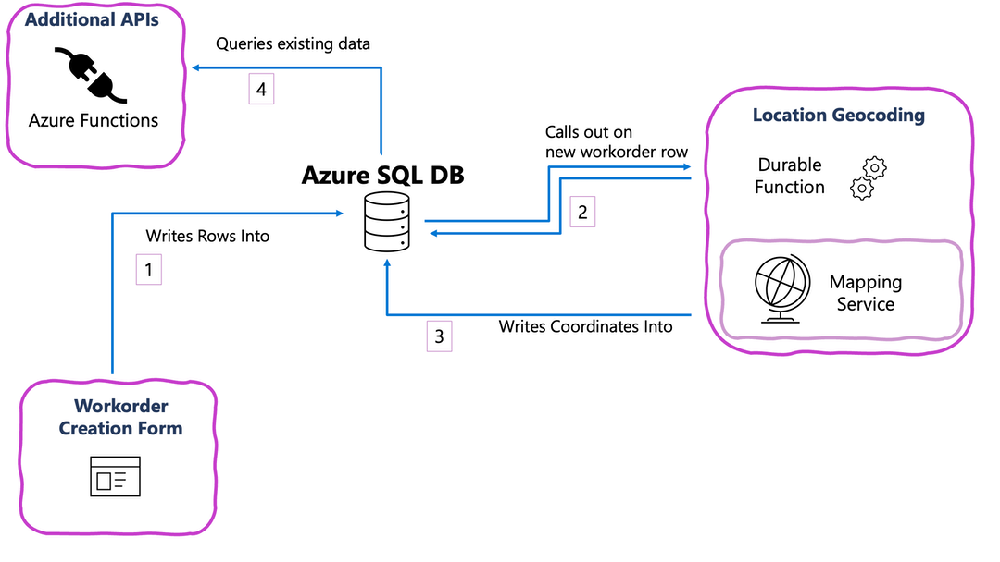

# Project Name

The geocoding sample for Azure SQL leverages the `sp_invoke_external_rest_endpoint` stored procedure in Azure SQL Database and Azure SQL bindings for Azure Functions to geocode addresses after they are inserted in a table.  In scenarios where the application inserting data to Azure SQL Database cannot be modified, it may be necessary to trigger a process after the data is inserted. 

## Getting Started

### Development Environment

- [.NET 6 SDK](https://dotnet.microsoft.com/download/dotnet/6.0)
- [Azure Functions Core Tools](https://learn.microsoft.com/azure/azure-functions/functions-run-local#install-the-azure-functions-core-tools)
- [VS Code and the Azure Functions extension](https://marketplace.visualstudio.com/items?itemName=ms-azuretools.vscode-azurefunctions)
- [mssql extension for VS Code](https://marketplace.visualstudio.com/items?itemName=ms-mssql.mssql)

### Overall Architecture

- the **Workorder Creation Form** is a hypothetical application that creates work orders in Azure SQL Database, writing only the summary and address information to the database
- the **Location Geocoding** durable Azure Functions are triggered by the database with `sp_invoke_external_rest_endpoint` to the `Workorder` table in Azure SQL Database if the workorder is missing the geocoding information
- the **Additional APIs** are Azure Functions with SQL bindings for reading and writing to the `Workorder` table in Azure SQL Database
- the **Data API Builder** component has more information available in the [Data API Builder README](./data-api-builder/readme.md)

## Local Quickstart, Geocoding

1. From the **Database Projects** pane, right-click the **workorder-database** project and select **Publish**. Follow the dialogs to **Publish to new Azure SQL Database emulator**, which will deploy the project's schema to a container.  The emulator will be available at `localhost,1433` with the username `sa` and password you specified.
2. Copy the file [functions/default.local.settings.json](./functions/default.local.settings.json) to `functions/local.settings.json` and update the `SqlConnectionString` value to point to the Azure SQL Database emulator.
3. Update the local Functions runtime settings with the **Azure Functions: Set AzureWebJobsStorage** command, which will link an Azure Storage account to the local Functions runtime for storing the state and queues of the durable function.
4. Create an [Azure Maps account](https://learn.microsoft.com/azure/azure-maps/quick-demo-map-app#create-an-azure-maps-account) and locate the [primary key](https://learn.microsoft.com/azure/azure-maps/quick-demo-map-app#get-the-primary-key-for-your-account). Add the primary key to `functions/local.settings.json` as the setting `AzureMapKey`.

*`sp_invoke_external_rest_endpoint` is not yet publicly available, to test the geocoding function you will need to send a POST request to the function's endpoint. A sample request is available in [testing.http](testing.http).*

## Local Quickstart, APIs with SQL bindings

1. If you have not already done so, follow the steps 1 and 2 in the **Local Quickstart, Geocoding** section to deploy the database project and configure the local Functions runtime.
2. In [testing.http](testing.http), two sample GET requests are provided to try the SQL bindings APIs.  The request with the route `/api/ListWorkorders` returns all workorders, the request with the route `/api/Workorder/{id}` returns a single workorder by ID.
3. In [testing.http](testing.http), a sample POST request is provided to try using the SQL bindings APIs to add a workorder.

## Resources

- [Azure SQL Database emulator](https://aka.ms/azuredbemulator)
- [SQL bindings for Azure Functions](https://aka.ms/sqlbindings)
